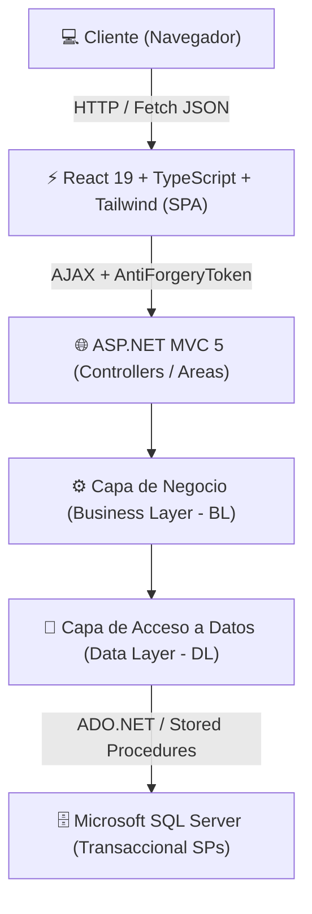

<div align="center">

# 💱 HomeChange (HomeMoney)
### Plataforma Fintech Empresarial de Cambio de Divisas & Remesas Digitales

[](https://react.dev/)
[](https://www.typescriptlang.org/)
[](https://tailwindcss.com/)
[](https://dotnet.microsoft.com/)
[](https://www.microsoft.com/sql-server)
[](https://opensource.org/licenses/MIT)

<p align="center">
  <b>Una solución Fintech integral, segura y moderna para la compra y venta de dólares y soles en tiempo real con arquitectura híbrida (ASP.NET MVC + React SPA).</b>
</p>

</div>

---

## 🌟 ¿Por qué HomeChange?

**HomeChange** resuelve el problema de las plataformas tradicionales de cambio de divisas: interfaces lentas, sistemas legados vulnerables y falta de transparencia. 

Diseñada bajo estándares de seguridad de aplicaciones y una estética moderna inspirada en Stripe y Wise, combina la estabilidad transaccional de **C# y SQL Server** con la agilidad y reactividad de un **Frontend SPA moderno en React 19 y Tailwind CSS**.

---

## ✨ Características Principales

### 💱 1. Motor de Tipo de Cambio en Tiempo Real
- Cotizador inteligente interactivo para Compra y Venta inmediata (USD ⇄ PEN).
- Bloqueo y garantía de tasa de cambio durante el proceso de transacción.
- Cálculo instantáneo de ahorros respecto a los tipos de cambio de la banca tradicional.

### 🏦 2. Gestión Bancaria y de Cuentas
- Registro de cuentas bancarias en múltiples entidades financieras (BCP, Interbank, BBVA, Scotiabank, BanBif, etc.).
- Soporte para cuentas propias y de terceros.
- Validación de números de cuenta estándar y Códigos de Cuenta Interbancario (CCI).

### 🧾 3. Flujo Transaccional & Comprobantes
- Ciclo de vida completo de la orden: Registro ➔ Transferencia ➔ Subida de Voucher ➔ Validación ➔ Desembolso.
- Carga segura de comprobantes de pago (PNG, JPG, PDF) protegida fuera de la raíz web.
- Historial dinámico de transacciones con estado en vivo y descargas de constancias.

### 👥 4. Multi-Perfil (Personal & Corporativo)
- Soporte en una misma cuenta para operar como Persona Natural (DNI/CE) o Empresa (RUC/Razón Social).
- Cambio ágil de perfiles de trabajo sin necesidad de re-iniciar sesión.

### 🛡️ 5. Seguridad Multicapa y Protección de Datos
- **Criptografía Robusta:** Hashing criptográfico unidireccional SHA-256 para contraseñas.
- **Protección Anti-CSRF/XSRF:** Tokens de verificación `RequestVerificationToken` implementados en todas las llamadas fetch/REST.
- **Defensas Anti-IDOR:** Validación estricta en base de datos de la propiedad de cuentas, perfiles y órdenes en cada petición HTTP.
- **Transaccionalidad ACID:** Procedimientos almacenados con bloques `BEGIN TRAN` y `COMMIT/ROLLBACK` para evitar registros huérfanos.

---

## 🏛️ Arquitectura del Sistema

El proyecto adopta una arquitectura en 4 capas desacopladas, complementada por una arquitectura moderna de islas React (Vite):



### Estructura del Proyecto

```plaintext
homeChange_vs2022/
├── AppHomeWeb.ReactFrontend/        # SPA moderna (React 19, TypeScript, Tailwind CSS, Vite)
├── AppHomeWeb.WebApplication/       # Controladores MVC, Vistas Host, Filtros de Seguridad
├── AppHomeWeb.Business/             # Lógica de negocio, validaciones y reglas financieras
├── AppHomeWeb.Data/                 # Acceso a datos relacional y ejecución de Stored Procedures
├── AppHomeWeb.Entity/               # Entidades de dominio y modelos de transferencia (DTO/BE)
├── database_schema.sql              # Esquema DDL de tablas e índices
├── sps_and_admin.sql                # Procedimientos almacenados transaccionales y usuario admin
├── seed_catalogos.sql               # Catálogos maestros (Bancos, Monedas, Documentos, etc.)
└── install_db.ps1                   # Script automatizado de despliegue de base de datos
```

---

## 🚀 Puesta en Marcha (Instalación Rápida)

### Requisitos Previos
- **Visual Studio 2022** (con carga de trabajo *Desarrollo de ASP.NET y Web*).
- **SQL Server 2019+** o **SQL Server LocalDB** (`(localdb)\MSSQLLocalDB`).
- **Node.js 18+** y `npm`.

### 1. Clonar el Repositorio
```bash
git clone https://github.com/emersonmadrid/homeChange_vs2022.git
cd homeChange_vs2022
```

### 2. Compilar el Frontend React
```bash
cd AppHomeWeb.ReactFrontend
npm install
npm run build
cd ..
```
*Esto compilará los módulos de TypeScript y colocará automáticamente el bundle optimizado en `AppHomeWeb.WebApplication/Scripts/react/`.*

### 3. Instalar la Base de Datos
Ejecuta el script de PowerShell en la consola:
```powershell
powershell -ExecutionPolicy Bypass -File .\install_db.ps1
```

### 4. Abrir y Ejecutar
1. Abre `AppHomeWeb.WebApplication.sln` en **Visual Studio 2022**.
2. Presiona <kbd>F5</kbd> o dale clic a **IIS Express**.
3. ¡Listo! La plataforma estará disponible en tu navegador local.

---

## 🔑 Credenciales de Prueba (Entorno de Desarrollo)

| Rol | Usuario / Correo | Contraseña |
| :--- | :--- | :--- |
| **Administrador** | `admin` (o `admin@homemoney.com`) | `admin` |
| **Cliente de Prueba** | Registro libre desde la pantalla inicial | Tu elección |

---

## 🤝 Contribuciones

¡Las contribuciones son más que bienvenidas! Si tienes sugerencias para mejorar el rendimiento, añadir nuevas pasarelas de pago o ampliar la seguridad:

1. Haz un Fork del proyecto.
2. Crea una rama para tu feature (`git checkout -b feature/NuevaFuncionalidad`).
3. Haz commit de tus cambios (`git commit -m 'feat: Añadir integración de pagos'`).
4. Haz push a la rama (`git push origin feature/NuevaFuncionalidad`).
5. Abre un **Pull Request**.

---

## 📄 Licencia

Distribuido bajo la Licencia **MIT**. Consulta el archivo [`LICENSE`](LICENSE) para más detalles.

---

<div align="center">
  <sub>Desarrollado con ❤️ por <a href="https://github.com/emersonmadrid">Emerson Madrid</a>. Si este proyecto te resulta útil o inspirador, ¡no dudes en dejar una ⭐ en GitHub!</sub>
</div>
