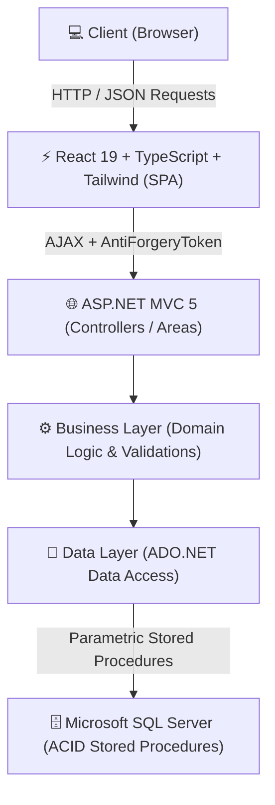

<div align="center">

# 💱 HomeChange
### Enterprise Fintech Currency Exchange & Digital Remittance Platform

[](https://react.dev/)
[](https://www.typescriptlang.org/)
[](https://tailwindcss.com/)
[](https://dotnet.microsoft.com/)
[](https://www.microsoft.com/sql-server)
[](https://opensource.org/licenses/MIT)

<p align="center">
  <b>A production-grade, secure, and modern Fintech platform for real-time currency exchange (USD ⇄ PEN) built with a hybrid enterprise architecture (ASP.NET MVC + React SPA).</b>
</p>

[**Read in Spanish (Español)**](README.es.md)

</div>

---

## 🌟 Overview & Architectural Modernization

Traditional currency exchange platforms often struggle with legacy monolithic debt, clunky user interfaces, and security vulnerabilities. 

**HomeChange** demonstrates an **enterprise architectural refactoring**: modernizing a legacy ASP.NET MVC monolithic application into a decoupled, high-performance **React 19 Single Page Application (SPA)** while preserving the rock-solid ACID transactional guarantees of **C# and SQL Server**.

Inspired by industry leaders like **Wise** and **Stripe**, it delivers an intuitive, minimalist user experience built upon robust security practices and data integrity.

---

## ✨ Key Features

### 💱 1. Real-Time FX Rate Engine
- Interactive live currency conversion calculator (USD ⇄ PEN / Buy & Sell rates).
- Rate-locking mechanism during the transaction and order verification window.
- Instant savings computation comparing bank rates versus platform rates.

### 🏦 2. Multi-Bank Account Management
- Full integration with commercial banking institutions (BCP, Interbank, BBVA, Scotiabank, BanBif, etc.).
- Support for personal accounts, business accounts, and verified third-party recipients.
- Standardized account number and Interbank Account Code (CCI) validation.

### 🧾 3. End-to-End Transaction Lifecycle
- Streamlined order workflow: **Order Generation ➔ Fund Transfer ➔ Secure Voucher Upload ➔ Admin Verification ➔ Payout**.
- File upload pipeline restricted to verified formats (`.png`, `.jpg`, `.pdf`) stored outside public web roots.
- Live order tracking dashboard with automated status updates.

### 👥 4. Multi-Profile Workspaces (Personal & Corporate)
- Seamless switching between **Personal Profile** (National ID / CE) and **Corporate Profile** (Tax ID / RUC / Legal Entity).
- Context-aware permissions ensuring data isolation across profiles.

### 🛡️ 5. Multi-Tier Application Security
- **Cryptographic Storage:** SHA-256 cryptographic hashing for user authentication.
- **Anti-CSRF / Anti-XSRF:** Strict `RequestVerificationToken` headers enforced across all AJAX/REST endpoints.
- **Server-Side Authorization (Anti-IDOR):** Database-backed verification ensuring users can only read or mutate accounts, profiles, and orders they legitimately own.
- **ACID Transactions:** T-SQL Stored Procedures structured with explicit `BEGIN TRAN`, `COMMIT`, and `ROLLBACK` blocks preventing orphan records.

---

## 🏛️ System Architecture

The project implements a decoupled **4-Layer Architecture** integrated with a Vite-powered **React Island SPA**:



### Directory Structure

```plaintext
homechange-fintech/
├── AppHomeWeb.ReactFrontend/        # Modern SPA (React 19, TypeScript, Tailwind CSS, Vite)
├── AppHomeWeb.WebApplication/       # Host MVC Controllers, Security Filters, Views
├── AppHomeWeb.Business/             # Business rules, domain validation, financial calculations
├── AppHomeWeb.Data/                 # Relational data layer executing Stored Procedures
├── AppHomeWeb.Entity/               # Data Transfer Objects (DTOs / Domain Entities)
├── database_schema.sql              # DDL schema definition (Tables, Keys, Constraints)
├── seed_catalogos.sql               # Master seeds (Banks, Currencies, Document Types)
├── sps_and_admin.sql                # Production Stored Procedures and Default Admin Seed
└── install_db.ps1                   # Automated database deployment script
```

---

## 🚀 Quick Start Guide

### Prerequisites
- **Visual Studio 2022** (with *.NET desktop development* and *ASP.NET and web development* workloads).
- **Microsoft SQL Server 2019+** or **SQL Server LocalDB** (`(localdb)\MSSQLLocalDB`).
- **Node.js 18+** & `npm`.

### 1. Clone the Repository
```bash
git clone https://github.com/emersonmadrid/homechange-fintech.git
cd homechange-fintech
```

### 2. Build the React Frontend
```bash
cd AppHomeWeb.ReactFrontend
npm install
npm run build
cd ..
```
*Vite compiles and bundles optimized assets directly into `AppHomeWeb.WebApplication/Scripts/react/`.*

### 3. Initialize the Database
Run the automated PowerShell deployment script:
```powershell
powershell -ExecutionPolicy Bypass -File .\install_db.ps1
```

### 4. Launch with Visual Studio
1. Open `AppHomeWeb.WebApplication.sln` in **Visual Studio 2022**.
2. Press <kbd>F5</kbd> or click **IIS Express**.
3. Navigate to `http://localhost:57927` in your browser.

---

## 🔑 Test Credentials (Development Environment)

| Role | Username / Email | Password |
| :--- | :--- | :--- |
| **System Administrator** | `admin` (or `admin@homemoney.com`) | `admin` |
| **Standard User** | Register freely via the onboarding UI | Your choice |

---

## 🤝 Contributing

Contributions, issues, and feature requests are welcome! Feel free to check out the [issues page](https://github.com/emersonmadrid/homechange-fintech/issues).

1. Fork the repository.
2. Create your feature branch (`git checkout -b feature/PaymentGatewayIntegration`).
3. Commit your changes (`git commit -m 'feat: Add payment gateway webhook'`).
4. Push to the branch (`git push origin feature/PaymentGatewayIntegration`).
5. Open a Pull Request.

---

## 📄 License

Distributed under the **MIT License**. See [`LICENSE`](LICENSE) for more information.

---

<div align="center">
  <sub>Engineered by <a href="https://github.com/emersonmadrid">Emerson Madrid</a>. If you find this project insightful, consider giving it a ⭐ on GitHub!</sub>
</div>
